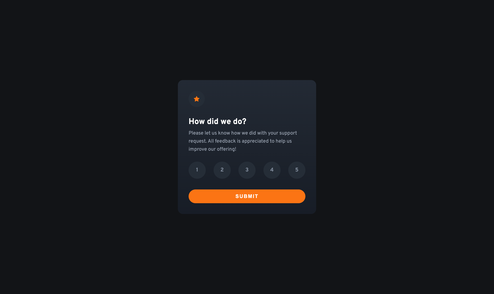

# Frontend Mentor - Interactive rating component solution

This is a solution to the [Interactive rating component challenge on Frontend Mentor](https://www.frontendmentor.io/challenges/interactive-rating-component-koxpeBUmI).

## Table of contents

- [Overview](#overview)
  - [The challenge](#the-challenge)
  - [Screenshot](#screenshot)
  - [Links](#links)
- [My process](#my-process)
  - [Built with](#built-with)
  - [What I learned](#what-i-learned)
  - [Useful resources](#useful-resources)
- [Author](#author)

## Overview

### The challenge

Users should be able to:

- View the optimal layout for the app depending on their device's screen size
- See hover states for all interactive elements on the page
- Select and submit a number rating
- See the "Thank you" card state after submitting a rating

### Screenshot



### Links

- Solution URL: [https://github.com/Blondeli/interactive-rating-component](https://github.com/Blondeli/interactive-rating-component)
- Live Site URL: [https://blondeli.github.io/interactive-rating-component/](https://blondeli.github.io/interactive-rating-component/)

## My process

### Built with

- Semantic HTML5 markup
- CSS custom properties
- CSS Grid
- Mobile-first workflow
- JavaScript

### What I learned

- I made custom radio buttons to create the rating form.

- I learned how to add and remove classes from elements using Javascript

```js
document.getElementById("rating-state").classList.add("hide");
document.getElementById("thank-you-state").classList.remove("hide");
```

### Useful resources

- [How To Make Custom Radio Buttons With Cool Effect | Pure CSS | DesignTorch](https://www.youtube.com/watch?v=GZh52Fh8o1o) - This video helped me to create custom radio buttons.

## Author

- Frontend Mentor - [@Blondeli](https://www.frontendmentor.io/profile/blondeli)
- LinkedIn - [Elisabeth Martin](https://www.linkedin.com/in/elisabeth-martin-873773199/)
